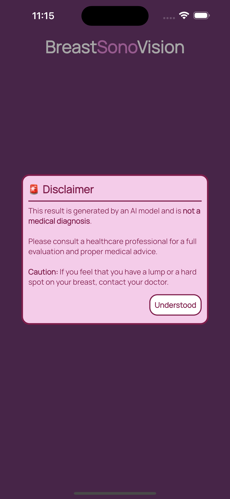

<div align="center">
  
  
  # BreastSonoVision Mobile Application
  
  A Flutter-based mobile application for breast ultrasound image segmentation and analysis, designed to assist healthcare professionals in early breast cancer detection.
  
  [](https://flutter.dev) [](https://dart.dev)
  
</div>

## 📱 Overview

BreastSonoVision is an innovative mobile application that leverages AI-powered image segmentation technology to assist medical professionals in analyzing breast ultrasound images. The app provides an intuitive interface for uploading, processing, and analyzing ultrasound images with advanced segmentation capabilities.

## ✨ Features

### 🎯 Core Functionality
- **AI-Powered Segmentation**: Advanced machine learning algorithms for accurate breast ultrasound image analysis
- **Image Upload & Processing**: Support for various image formats with real-time processing
- **Results Visualization**: Clear visualization of segmentation results with comparison tools
- **Notification System**: Scheduled reminders and result notifications
- **Multi-language Support**: Localized interface for global accessibility

### 🔧 Technical Features
- **Cross-platform**: Built with Flutter for iOS and Android
- **Export & Share**: Easy sharing of results with colleagues
- **User Preferences**: Customizable settings and preferences

## 📸 Screenshots

### Landing & Onboarding
<div align="center">
  
  
  
  
</div>

The app features a welcoming landing screen and comprehensive onboarding process to guide users through the application's capabilities.

### Home & Navigation
<div align="center">
  
  
  
</div>

Clean and intuitive home interface with easy navigation through the side drawer menu.

### Analysis & Results
<div align="center">
  
  
  
</div>

Detailed analysis results with segmentation overlays and comparison tools for thorough examination.

### Additional Features
<div align="center">
  
  
  
  
</div>

Multi-language support, notification management, and sharing capabilities.

### Important Information
<div align="center">
  
</div>

The app includes important medical disclaimers and usage guidelines for healthcare professionals.

## 🚀 Getting Started

### Prerequisites
- Flutter SDK (^3.24.5 • stable)
- Dart SDK (^3.5.4 • stable)
- Android Studio / Xcode for device testing
- Compatible Android/iOS device or emulator

### Installation

1. **Clone the repository**
   ```bash
   git clone https://github.com/veysel-ozdemir/breast-sono-vision-mobile.git
   cd breast-sono-vision-mobile/breast_sono_vision
   ```

2. **Install dependencies**
   ```bash
   flutter pub get
   ```

3. **Configure environment**
   ```bash
   # Create .env file in the root directory
   cp .env.example .env
   # Add your API endpoints and configuration
   ```

4. **Run the application**
   ```bash
   flutter run
   ```

## 🛠️ Technology Stack

- **Framework**: Flutter
- **Language**: Dart
- **State Management**: GetX
- **Local Storage**: SharedPreferences
- **Image Processing**: [nnU-net](https://github.com/veysel-ozdemir/nnUNet)
- **Animations**: Lottie
- **Notifications**: Flutter Local Notifications
- **File Handling**: File Picker, Image Picker
- **UI Components**: Material Design, Google Fonts

## 📦 Dependencies

### Core Dependencies
- `flutter`: SDK framework
- `get`: State management and routing
- `shared_preferences`: Local data persistence
- `file_picker` & `image_picker`: File and image selection
- `permission_handler`: Device permissions
- `http`: Network requests
- `flutter_dotenv`: Environment configuration

### UI & UX
- `google_fonts`: Typography
- `lottie`: Animations
- `flutter_launcher_icons`: App icons
- `flutter_native_splash`: Splash screen

### Features
- `gal`: Gallery access
- `share_plus`: Sharing functionality
- `flutter_local_notifications`: Push notifications
- `timezone`: Time zone handling

## 🏗️ Project Structure

```
lib/
├── main.dart                 # Application entry point
├── app/                      # App-level configuration
├── config/                   # Configuration files
├── core/                     # Core utilities and constants
├── data/                     # Data layer (repositories, data sources)
├── domain/                   # Domain layer (entities, use cases)
└── presentation/             # UI layer (screens, widgets)
```

## 🔒 Privacy & Security

- All image processing is performed locally on the device
- No patient data is transmitted to external servers
- Secure local storage with encryption
- Compliance with medical data handling regulations

## ⚠️ Medical Disclaimer

**IMPORTANT**: This application is designed as a diagnostic aid tool for healthcare professionals. It should not be used as the sole basis for medical diagnosis. Always consult with qualified medical professionals and follow established medical protocols.

## 📄 License

This project is licensed under the MIT License - see the [LICENSE](LICENSE) file for details.

## 🤝 Contributing

We welcome contributions to improve BreastSonoVision! Please read our contributing guidelines and submit pull requests for any enhancements.

## 📞 Support

For technical support or questions about the application:
- Create an issue in this repository
- Contact the development team
- Refer to the documentation

## 👤 Contact
For questions or collaboration, reach out at:
- **Email:** ozdemirsoftware.dev@gmail.com
- **GitHub:** [veysel-ozdemir](https://github.com/veysel-ozdemir/)
- **LinkedIn:** [Veysel Ozdemir](https://www.linkedin.com/in/ozdemir-veysel/)
- **Apple App Store:** [Developer Page](https://apps.apple.com/de/developer/veysel-ozdemir/id1791593374)
- **Google Play Store:** [Developer Page](https://play.google.com/store/apps/dev?id=7737397220295288084&pli=1)

## 🙏 Acknowledgments

- Medical professionals who provided domain expertise
- Flutter community for excellent packages and tools
- Healthcare institutions supporting this initiative

---

> 🎗️ Making breast cancer detection more accessible through technology
